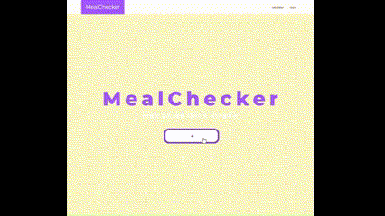

# 겅민정 포트폴리오

환영합니다! 이 포트폴리오에서는 저의 프로젝트와 성과를 확인하실 수 있습니다.

# - Meal Checker
  
### Meal Checker는 식품 공공 데이터를 활용하여 사용자의 식단을 체크할 수 있는 웹 애플리케이션입니다. 이 프로젝트는 건강한 식단 관리를 위해 만들어졌으며, 사용자는 섭취한 음식의 영양 성분을 쉽게 확인할 수 있습니다.

## [Meal Checker(바로가기)](https://github.com/kanyDev/meal_checker)

## 특징

- **공공 데이터 활용**: 공공 식품 데이터베이스를 사용하여 다양한 음식의 영양 정보를 제공합니다.
- **식단 관리**: 사용자가 섭취한 음식의 영양 성분을 입력하면, 이를 바탕으로 일일 영양소 섭취량을 계산하고 시각화합니다.
- **사용자 친화적 인터페이스**: 직관적인 웹 인터페이스를 통해 쉽게 사용할 수 있습니다.

## 사용기술

- **HTML**: 구조적인 웹 페이지 마크업을 작성하는 데 사용
- **CSS**: 웹 페이지의 스타일링 및 레이아웃 디자인
- **JavaScript**: 클라이언트 측 로직 및 API 통신
- **Fetch API**: 공공 데이터 포털 API로부터 데이터를 가져오는 데 사용
- **공공 데이터 포털 API**: 식품 영양 성분 데이터를 제공

# - LINCO

### **LINCO**는 취향이 같은 사람끼리 모임을 만드는 웹사이트입니다. 사용자는 다양한 클럽과 소셜링을 생성하고 참여할 수 있으며, 이를 통해 지속 가능한 일회성 모임을 진행할 수 있습니다. LINCO2는 소셜 로그인, 결제 기능, 공공 데이터 및 구글맵 API를 활용한 장소 선택 기능을 제공합니다.

## [LINCO(바로가기)](https://github.com/kanyDev/LINCO2)

#### 주요 기능

- **소셜 로그인**: Google, Naver, Kakao 등 다양한 소셜 로그인 기능을 제공.
- **클럽 및 소셜링 생성**: 사용자가 클럽 및 소셜링을 생성하고 관리할 수 있습니다.
- **결제 기능**: Iamport API를 통해 결제 및 결제 취소 기능을 제공.
- **데이터 시각화**: 구글맵 API와 서울시 대관 API를 활용한 장소 선택 및 예약 기능.
- **게시판 및 사진첩**: 클럽 생성 시 게시판과 사진첩이 자동으로 생성되어 커뮤니티 활동 가능.
- **마이페이지**: 사용자의 활동과 정보를 확인할 수 있는 개인 페이지 제공.
- **예약 관리**: 공공 데이터 openAPI를 활용한 예약 페이지 구현.

#### 사용 기술

- **HTML, CSS, JavaScript**: UI 구현 및 스타일링.
- **Bootstrap**: 반응형 웹 디자인.
- **Spring Boot**: 백엔드 프레임워크.
- **Spring Security**: 보안 및 인증.
- **OAuth2**: 소셜 로그인 구현.
- **MyBatis**: 데이터베이스 통신.
- **MySQL**: 데이터베이스 관리.
- **Thymeleaf**: 서버사이드 템플릿 엔진.
- **AJAX**: 비동기 통신.
- **REST API**: API 통신.
- **공공 데이터 API**: 서울시 대관 API, 구글맵 API.
- **EC2, RDS**: 서버 배포 및 관리.
- **Postman**: API 테스트.
- **Lombok**: 자바 코드를 간결하게.
- **Validator**: 입력 유효성 검사.

●과정명:  (디지털컨버전스) 공공데이터를 융합한 자바기반 Spring 웹개발자 양성과정

●교육기간 : 2024.03.26 ~ 2024.08.29 (총 832시간)

●교육내용 

JAVA 프로그래밍 (128시간)
 기본문법, 객체지향 프로그래밍, 다형성, Collection, Exception, Inner class, IOStream, Stream, Lambda, 

RDBMS(40시간)
 DML, DDL, DCL, 단일행/그룹함수, Join, SubQuery, View, 트랜잭션, ER-diagram, 정규화

웹 표준  (112시간)
 HTML 5 / CSS3 / JavaScript / jQuery
 반응형웹 / BootStrap / AJAX. fetch API / JSON / XML /

Spring Framework (88시간)
 Dependency Injection, Autowire, DI Config,  SpringBoot, Sping MVC
 request mapping, validation, Security,  MyBatis, RestTemplate

GitHub (8시간)

Linux, AWS  (24시간)
 배포,  자동재배포

스프링 기반 웹 애플리케이션 프로젝트 (160시간)
